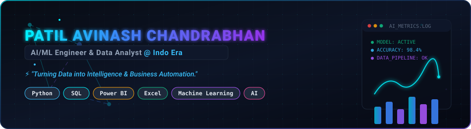

  <!-- Animated Hero Banner -->
  

 

  <!-- HUD Status Card -->
  

 

<!-- Visual Section Separator -->

  

## 👨‍💻 Professional Introduction

I am **Patil Avinash Chandrabhan**, currently working professionally as a **Data Analyst & AI/ML Engineer at Indo Era**. My day-to-day work centers around transforming raw complex datasets into actionable business intelligence, developing automated data pipelines, and creating analytical solutions using **Python, SQL, Power BI, and Excel**.

With a strong engineering mindset, I am continuously advancing my capabilities in **Machine Learning, Data Science, and Artificial Intelligence**—focusing on predictive modeling, exploratory data analysis, and building intelligent automation systems for real-world enterprise workflows.

---

## 🔭 Currently Working On

- ⚡ **Enterprise Data Automation**: Developing automated Python & SQL data validation, extraction, and transformation workflows.
- 📊 **E-Commerce & Business Intelligence**: Designing interactive Power BI & Excel dashboards for sales, revenue, and KPI monitoring at Indo Era.
- 🤖 **Machine Learning Pipelines**: Experimenting with scikit-learn models for data classification, regression, and customer trend prediction.
- ⚙️ **Data Processing Systems**: Building full-stack web interfaces (FastAPI + MySQL + Pandas) for rapid data ingestion and reporting.

---

<!-- Visual Section Separator -->

  

## 🤖 AI & Machine Learning

I view Machine Learning and Artificial Intelligence as natural evolutions of advanced data analytics. I am actively expanding my practical expertise across the end-to-end ML lifecycle:

- 🔍 **Exploratory Data Analysis (EDA)**: Statistical summaries, feature distribution analysis, outlier detection, and data cleaning with `Pandas` and `NumPy`.
- ⚙️ **Feature Engineering**: Normalization, categorical encoding, feature selection, and data transformation for model readiness.
- 🎯 **Model Training & Experimentation**: Implementation of supervised learning algorithms using `Scikit-learn` (Regression, Decision Trees, Classification, Clustering).
- 📈 **Model Evaluation & Tuning**: Assessing accuracy, precision, recall, RMSE, and cross-validation performance.
- 🤖 **AI Automation**: Automating data analytical workflows using Python scripts and intelligent data pipelines.

---

## 📊 Data Analytics & Business Intelligence

- 📑 **Advanced Excel**: Complex formulas (`XLOOKUP`, `INDEX/MATCH`), Power Query ETL, dynamic Pivot Tables, and VBA macro automation.
- 🛢️ **SQL & Database Management**: Complex queries, subqueries, `JOIN` operations, window functions, aggregations, and performance tuning in MySQL & PostgreSQL.
- 📈 **Power BI & Visual Analytics**: DAX measure engineering, interactive dashboard architecture, data modeling (Star Schema), and executive KPI reporting.
- 🐍 **Python Analytics**: Data manipulation, aggregation, time-series analysis, and data cleaning using `Pandas`, `NumPy`, and visualization libraries.

---

<!-- Visual Section Separator -->

  

## 💻 Tech Stack & Tools

<table align="center" width="100%">
  <tr>
    <td width="50%" valign="top">
      <h3 align="center">📊 Data Analytics & BI</h3>
      

        
        
        
          
        
        
        
      

    </td>
    <td width="50%" valign="top">
      <h3 align="center">🤖 AI & Machine Learning</h3>
      

        
        
          
        
        
      

    </td>
  </tr>
  <tr>
    <td width="50%" valign="top">
      <h3 align="center">⚙️ Backend & Data Engineering</h3>
      

        
        
        
          
        
        
      

    </td>
    <td width="50%" valign="top">
      <h3 align="center">🛠️ Development & Tools</h3>
      

        
        
        
          
        
        
      

    </td>
  </tr>
</table>

---

<!-- Visual Section Separator -->

  

## 🚀 Professional Journey

<table align="center" width="100%">
  <thead>
    <tr>
      <th align="center" width="15%">Year</th>
      <th align="left" width="35%">Focus & Domain</th>
      <th align="left" width="50%">Key Milestones & Technical Growth</th>
    </tr>
  </thead>
  <tbody>
    <tr>
      <td align="center"><b>2024</b></td>
      <td><b>Technical Foundations</b></td>
      <td>Mastered Python programming fundamentals, relational database design, core SQL, and advanced Excel logic.</td>
    </tr>
    <tr>
      <td align="center"><b>2025</b></td>
      <td><b>Data Analytics & BI Systems</b></td>
      <td>Built interactive Power BI dashboards, structured financial analytics tools, and developed data ETL workflows using Pandas & MySQL.</td>
    </tr>
    <tr>
      <td align="center"><b>2026</b></td>
      <td><b>Professional Role @ Indo Era</b></td>
      <td>Working professionally as Data Analyst & AI/ML Engineer. Managing business intelligence dashboards, Python automation, and SQL data solutions.</td>
    </tr>
    <tr>
      <td align="center"><b>2026+</b></td>
      <td><b>AI / ML & Scalable Data Science</b></td>
      <td>Expanding deeper into Machine Learning algorithms, predictive analytics, enterprise AI automation, and large-scale data engineering.</td>
    </tr>
  </tbody>
</table>

---

## ⭐ Featured Projects

<table align="center" width="100%">
  <thead>
    <tr>
      <th align="left" width="28%">Project Name</th>
      <th align="left" width="45%">Description</th>
      <th align="center" width="27%">Tech Stack</th>
    </tr>
  </thead>
  <tbody>
    <tr>
      <td><b><a href="https://github.com/Patilavinash4433/Zomato_Performance_Analytics_Dashboard">🍕 Zomato Analytics Dashboard</a></b></td>
      <td>Interactive Power BI dashboard analyzing food delivery sales, customer behavior, restaurant metrics, and city-wise performance insights.</td>
      <td align="center">
        <code>Power BI</code> <code>DAX</code> <code>Excel</code>
      </td>
    </tr>
    <tr>
      <td><b><a href="https://github.com/Patilavinash4433/TechNova_Revenue_Dashboard">📈 TechNova Revenue Dashboard</a></b></td>
      <td>Financial analytics web dashboard built for interactive revenue tracking, real-time KPI monitoring, and business visual trends.</td>
      <td align="center">
        <code>JavaScript</code> <code>Chart.js</code> <code>HTML/CSS</code>
      </td>
    </tr>
    <tr>
      <td><b><a href="https://github.com/Patilavinash4433/Student_Data_Manager">⚙️ Student Data Manager</a></b></td>
      <td>Full-stack data processing application for uploading Excel files, processing data via FastAPI & Pandas, and persisting in MySQL.</td>
      <td align="center">
        <code>Python</code> <code>FastAPI</code> <code>MySQL</code> <code>Pandas</code>
      </td>
    </tr>
    <tr>
      <td><b><a href="https://github.com/Patilavinash4433/Sales_Analytics_Dashboard_Excel">📊 Sales Analytics (Excel BI)</a></b></td>
      <td>Dynamic Excel business intelligence dashboard tracking key sales metrics, revenue growth, customer retention, and executive KPIs.</td>
      <td align="center">
        <code>Advanced Excel</code> <code>Power Query</code> <code>Pivot Tables</code>
      </td>
    </tr>
    <tr>
      <td><b><a href="https://github.com/Patilavinash4433/Avinash_Patil_Portfolio">🌐 Personal Web Portfolio</a></b></td>
      <td>Cinematic web portfolio showcasing data analytics dashboards, BI projects, data engineering applications, and professional background.</td>
      <td align="center">
        <code>TypeScript</code> <code>React</code> <code>Web Analytics</code>
      </td>
    </tr>
  </tbody>
</table>

---

<!-- Visual Section Separator -->

  

## 📈 GitHub Statistics

  <table border="0">
    <tr>
      <td>
        
      </td>
      <td>
        
      </td>
    </tr>
  </table>

   

  

 

  

---

<!-- Visual Section Separator -->

  

## 👾 Contribution Animations

   
  
<b>🎮 Pacman Contribution Graph</b>

  

 

  
<b>🐍 Contribution Snake</b>

  

---

<!-- Visual Section Separator -->

  

## 📫 Connect With Me

  
  &nbsp;
  
  &nbsp;
  
  &nbsp;
  
  &nbsp;
  

 

  

 

  Designed with 💙 for <b>Patil Avinash Chandrabhan</b> | AI/ML Engineer &amp; Data Analyst

